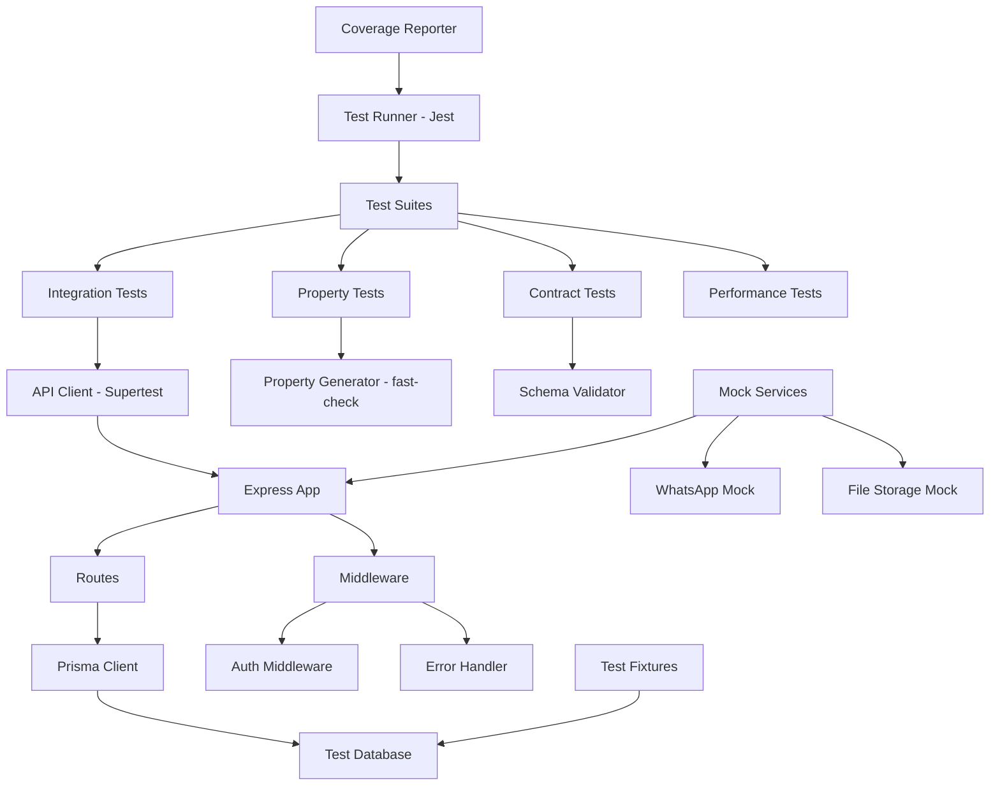

# Design Document: API Testing Infrastructure

## Overview

The API Testing Infrastructure provides comprehensive automated testing for all backend API endpoints in the Express + Prisma system. The infrastructure addresses the critical problem of APIs returning success messages while containing validation failures, authentication bypasses, incorrect data handling, and database constraint violations.

The design implements a multi-layered testing strategy:
- **Integration tests** for complete API workflows with database operations
- **Contract validation** to ensure request/response schemas match specifications
- **Property-based tests** for business logic invariants and edge case discovery
- **Performance tests** for response time validation under load
- **Mock services** for external dependencies (WhatsApp, file storage)

The infrastructure tests all existing routes: authentication (`/api/auth`), bookings (`/api/bookings`), jobs (`/api/jobs`), blog (`/api/blog`), tools (`/api/tools`), profile (`/api/profile`), working hours (`/api/working-hours`), and upload (`/api/upload`).

**Technology Stack:**
- **Test Runner:** Jest (compatible with Node.js CommonJS, excellent ecosystem)
- **API Client:** Supertest (Express-specific, session handling, assertions)
- **Property Testing:** fast-check (mature, TypeScript support, shrinking)
- **Database:** PostgreSQL test database with Prisma migrations
- **Mocking:** Jest built-in mocks for external services

## Architecture

### Test Infrastructure Layers



### Testing Workflow

1. **Setup Phase:**
   - Start test database (PostgreSQL test instance)
   - Run Prisma migrations to create schema
   - Seed baseline data via fixtures
   - Initialize Express app in test mode
   - Configure mocks for external services

2. **Execution Phase:**
   - Jest executes test suites in parallel (configurable)
   - Each test suite uses isolated database transactions
   - Supertest makes HTTP requests to Express app
   - fast-check generates random inputs for property tests
   - Assertions validate responses, database state, and invariants

3. **Teardown Phase:**
   - Roll back database transactions
   - Clean up uploaded test files
   - Reset mocks
   - Generate coverage reports

### Test Database Isolation Strategy

**Option 1: Transaction Rollback (Recommended)**
- Each test runs in a Prisma transaction
- Transaction rolls back after test completion
- Fast, no database recreation overhead
- Ensures complete isolation between tests

**Option 2: Database Recreation**
- Drop and recreate test database for each test suite
- Slower but guarantees clean slate
- Useful for migration testing

**Implementation:** Use transaction rollback for unit/integration tests, database recreation for full end-to-end suite.

## Components and Interfaces

### 1. Test Configuration Module (`tests/config/setup.js`)

**Responsibilities:**
- Initialize test environment variables
- Configure Jest global settings
- Set up database connection
- Register global teardown hooks

**Interface:**
```javascript
// tests/config/setup.js
module.exports = {
  setupTestDatabase: async () => PrismaClient,
  teardownTestDatabase: async (prisma) => void,
  getTestConfig: () => TestConfig,
  setupGlobalMocks: () => void
}

interface TestConfig {
  databaseUrl: string;
  jwtSecret: string;
  testTimeout: number;
  parallelWorkers: number;
}
```

**Key Decisions:**
- Use separate `DATABASE_URL_TEST` environment variable
- Set Jest timeout to 10s for integration tests, 5s for unit tests
- Enable parallel execution with 2 workers (balance speed vs. resource usage)

### 2. Test Fixtures Module (`tests/fixtures/index.js`)

**Responsibilities:**
- Provide reusable test data generators
- Seed database with baseline data
- Create authenticated user contexts
- Generate valid/invalid input samples

**Interface:**
```javascript
// tests/fixtures/index.js
module.exports = {
  createTestUser: async (prisma, overrides?) => User,
  createTestBooking: async (prisma, overrides?) => Booking,
  createTestJob: async (prisma, overrides?) => Job,
  createTestBlogPost: async (prisma, overrides?) => BlogPost,
  createTestTool: async (prisma, overrides?) => Tool,
  seedDatabase: async (prisma) => void,
  clearDatabase: async (prisma) => void,
  getAuthToken: (userId: string) => string
}
```

**Fixture Data Strategy:**
- Default fixtures cover common scenarios
- Override mechanism for test-specific variations
- Consistent IDs for predictable assertions
- Locale-appropriate test data (Arabic strings)

### 3. API Test Helpers (`tests/helpers/api.js`)

**Responsibilities:**
- Wrap Supertest with common patterns
- Provide authenticated request helpers
- Abstract response validation
- Handle common assertions

**Interface:**
```javascript
// tests/helpers/api.js
module.exports = {
  makeRequest: (app) => SupertestWrapper,
  authenticatedRequest: (app, token) => AuthenticatedWrapper,
  expectSuccess: (response) => void,
  expectError: (response, statusCode, message?) => void,
  expectValidationError: (response, fields) => void
}

class SupertestWrapper {
  get(path: string): Promise<Response>
  post(path: string, body: object): Promise<Response>
  put(path: string, body: object): Promise<Response>
  delete(path: string): Promise<Response>
}
```

### 4. Contract Validator (`tests/validators/contracts.js`)

**Responsibilities:**
- Define expected schemas for all endpoints
- Validate request/response structure
- Report schema violations
- Support nested object validation

**Interface:**
```javascript
// tests/validators/contracts.js
module.exports = {
  validateAuthLoginResponse: (response) => ValidationResult,
  validateBookingResponse: (response) => ValidationResult,
  validateJobResponse: (response) => ValidationResult,
  validateBlogPostResponse: (response) => ValidationResult,
  validateToolResponse: (response) => ValidationResult,
  validateProfileResponse: (response) => ValidationResult,
  validateWorkingHoursResponse: (response) => ValidationResult,
  validateErrorResponse: (response) => ValidationResult
}

interface ValidationResult {
  valid: boolean;
  errors: string[];
}
```

**Schema Definition Approach:**
- Use plain JavaScript object schemas (avoid external dependencies)
- Check required fields, data types, and formats
- Validate nested objects and arrays
- Support optional field validation

### 5. Property Generators (`tests/properties/generators.js`)

**Responsibilities:**
- Define fast-check arbitraries for domain models
- Generate valid and invalid inputs
- Create edge cases (empty, very long, special characters)
- Support compound generators

**Interface:**
```javascript
// tests/properties/generators.js
const fc = require('fast-check');

module.exports = {
  validEmail: () => fc.Arbitrary<string>,
  validPassword: () => fc.Arbitrary<string>,
  validBookingDate: () => fc.Arbitrary<string>,
  validBookingTime: () => fc.Arbitrary<string>,
  validBlogTitle: () => fc.Arbitrary<string>,
  validSlug: () => fc.Arbitrary<string>,
  validFileName: () => fc.Arbitrary<string>,
  validFileSize: () => fc.Arbitrary<number>,
  validWorkingHourSlot: () => fc.Arbitrary<{start: string, end: string}>,
  
  // Compound generators
  validBooking: () => fc.Arbitrary<BookingInput>,
  validJob: () => fc.Arbitrary<JobInput>,
  validBlogPost: () => fc.Arbitrary<BlogPostInput>
}
```

**Generator Design Principles:**
- Bias toward realistic data (not random garbage)
- Include boundary values (min/max lengths, edge times)
- Generate both ASCII and Arabic text for i18n testing
- Support dependent values (e.g., start time before end time)

### 6. Mock Service Manager (`tests/mocks/services.js`)

**Responsibilities:**
- Mock WhatsApp API integration
- Mock file storage operations
- Track mock invocations
- Configure mock responses

**Interface:**
```javascript
// tests/mocks/services.js
module.exports = {
  mockWhatsApp: {
    sendMessage: jest.fn(),
    sendNotification: jest.fn(),
    reset: () => void,
    getCallHistory: () => Call[]
  },
  
  mockFileStorage: {
    upload: jest.fn(),
    delete: jest.fn(),
    exists: jest.fn(),
    reset: () => void
  },
  
  setupMocks: () => void,
  resetAllMocks: () => void
}
```

**Mock Configuration:**
- Default success responses
- Configurable failure scenarios
- Call tracking for assertions
- Automatic cleanup between tests

### 7. Test Database Manager (`tests/helpers/database.js`)

**Responsibilities:**
- Manage test database lifecycle
- Provide transaction-based isolation
- Handle schema migrations
- Clean up test data

**Interface:**
```javascript
// tests/helpers/database.js
module.exports = {
  initTestDatabase: async () => PrismaClient,
  runMigrations: async (prisma) => void,
  startTransaction: async (prisma) => Transaction,
  rollbackTransaction: async (transaction) => void,
  clearAllData: async (prisma) => void,
  closeDatabase: async (prisma) => void
}
```

**Transaction Isolation Pattern:**
```javascript
let tx;
beforeEach(async () => {
  tx = await startTransaction(prisma);
});
afterEach(async () => {
  await rollbackTransaction(tx);
});
```

### 8. Performance Test Utilities (`tests/helpers/performance.js`)

**Responsibilities:**
- Measure response times
- Execute concurrent requests
- Report performance metrics
- Flag slow endpoints

**Interface:**
```javascript
// tests/helpers/performance.js
module.exports = {
  measureResponseTime: async (requestFn) => number,
  runConcurrent: async (requestFn, count) => PerformanceResult,
  expectResponseTime: (time, maxMs) => void
}

interface PerformanceResult {
  totalRequests: number;
  successfulRequests: number;
  failedRequests: number;
  avgResponseTime: number;
  minResponseTime: number;
  maxResponseTime: number;
}
```

## Data Models

### Test Configuration

```javascript
// Test environment configuration
const testConfig = {
  database: {
    url: process.env.DATABASE_URL_TEST,
    resetStrategy: 'transaction', // 'transaction' | 'recreate'
  },
  jwt: {
    secret: process.env.JWT_SECRET || 'test-secret',
    expiresIn: '1h'
  },
  server: {
    port: 5001, // Different from dev server
    timeout: 10000
  },
  jest: {
    testTimeout: 10000,
    verbose: true,
    collectCoverage: true,
    coverageThreshold: {
      global: {
        statements: 80,
        branches: 75,
        functions: 80,
        lines: 80
      }
    }
  },
  mocks: {
    whatsapp: true,
    fileStorage: true
  }
}
```

### Test Fixture Models

```javascript
// Default test user
const testUser = {
  email: 'test@example.com',
  password: 'Test123!@#',
  role: 'admin'
};

// Default test booking
const testBooking = {
  name: 'أحمد محمد',
  whatsapp: '+966501234567',
  jobStatus: 'موظف',
  message: 'أريد استشارة حول التطوير المهني',
  date: '2024-12-31',
  time: '10:00',
  platform: 'google_meet',
  status: 'pending'
};

// Default test job
const testJob = {
  title: 'مدير مبيعات',
  company: 'شركة اختبار',
  location: 'الرياض',
  type: 'full_time',
  description: 'وصف الوظيفة',
  requirements: ['خبرة 3 سنوات', 'لغة إنجليزية'],
  salary: '10000 - 15000 ريال',
  applyLink: 'https://example.com/apply',
  isActive: true
};

// Default test blog post
const testBlogPost = {
  title: 'مقالة تجريبية',
  slug: 'test-blog-post',
  excerpt: 'ملخص المقالة',
  content: 'محتوى المقالة الكامل',
  tags: ['مبيعات', 'تطوير'],
  isPublished: false,
  readTime: 5
};
```

### Contract Schemas

```javascript
// Authentication response schema
const authLoginResponseSchema = {
  success: 'boolean',
  token: 'string',
  user: {
    id: 'string',
    email: 'string',
    role: 'string'
  }
};

// Booking response schema
const bookingResponseSchema = {
  success: 'boolean',
  booking: {
    id: 'string',
    name: 'string',
    whatsapp: 'string',
    jobStatus: 'string',
    message: 'string',
    date: 'string',
    time: 'string',
    platform: 'string',
    meetingLink: 'string',
    status: 'string',
    whatsappNotified: 'boolean',
    createdAt: 'string',
    updatedAt: 'string'
  }
};

// Error response schema
const errorResponseSchema = {
  success: 'boolean',
  message: 'string',
  errors: 'array?' // Optional validation errors
};
```

## Data Models (continued)

### Property Test Configuration

```javascript
// fast-check property test configuration
const propertyTestConfig = {
  numRuns: 100, // Minimum iterations per property
  timeout: 5000, // Per-test timeout
  seed: undefined, // Random seed (set for reproducibility)
  endOnFailure: false, // Continue after first failure
  verbose: true, // Show shrinking process
  
  // Custom parameters for specific properties
  slugGenerationRuns: 200, // More iterations for slug uniqueness
  authTokenRuns: 100,
  crudSequenceRuns: 50 // Fewer for expensive operations
};
```

